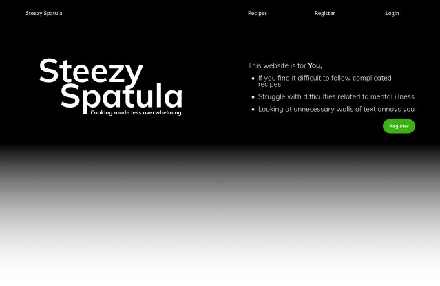

# Steezy Spatula - cooking made less overwhelming

The Steezy Spatula is a responsive web application aiming to help people who are struggling with idea of cooking in general, by providing recipes that are easy to follow and without any unnecessary or additional information.

!!! amiresponsive image !!!

The live website can be viewed here: [Steezy Spatula - cooking made less overwhelming](https://steezy-spatula.herokuapp.com/)

---

## CONTENTS

* [User Experience](#user-experience-ux)
  * [User Stories](#user-stories)

* [Design](#design)
  * [Colour Scheme](#colour-scheme)
  * [Typography](#typography)
  * [Imagery](#imagery)
  * [Wireframes](#wireframes)

* [Features](#features)
  * [General Features on Each Page](#general-features-on-each-page)
  * [Future Implementations](#future-implementations)
  * [Accessibility](#accessibility)

* [Technologies Used](#technologies-used)
  * [Languages Used](#languages-used)
  * [Frameworks, Libraries & Programs Used](#frameworks-libraries--programs-used)

* [Deployment & Local Development](#deployment--local-development)
  * [Deployment](#deployment)
  * [Local Development](#local-development)
    * [How to Fork](#how-to-fork)
    * [How to Clone](#how-to-clone)

* [Testing](#testing)

* [Credits](#credits)
  * [Code Used](#code-used)
  * [Content](#content)
  * [Media](#media)
  * [Acknowledgments](#acknowledgments)

---

## User Experience (UX)

The primary aim of this website is to help users gain confidence in the kitchen by providing simple and easy-to-follow recipes. The main goal is to make the experience as stress-free and uncomplicated as possible, without overwhelming users with unnecessary information.

By registering on the website, users can access additional features, including the ability to add recipes they believe are worth sharing and beneficial to others. Registered users can also edit their uploaded recipes and view their saved recipes under the "My Stuff" tab. While deleting a recipe entry is available, I would encourage users not to do so, as it someone could fint it helpful.

Even if users don't have a recipe to share yet, they can browse the existing list of recipes found in the recipes section and save recipes they like to their list. Additionally, users can share their thoughts and participate in conversations by leaving comments under any recipe. Users can also delete or update their comments as needed.

## Design thinking

I was thrilled to come up with the idea for my project, as it was something I could see myself using. Having a difficult relationship with cooking myself, it was easy to empathize with potential end-users of the website. For me, the most important aspect of the design was to ensure that the webpage had the least amount of clutter possible.

While there are many recipe websites out there, I could not find any that truly catered to individuals with depression and anxiety, especially when it came to cooking. Even if I found an easy recipe on one of these sites, I often had to scroll through endless descriptions and irrelevant information, which only further discouraged me from cooking. This tedious experience is not a solution for people who need guidance, like myself. That's why my website cuts straight to the point, presenting only the relevant and important information.

One of my proudest accomplishments in the design is the progress bar displayed with different colors on the recipe card. I had the idea to make this progress bar differently colored based on the recipe's difficulty, so users can easily judge if they have the mental capacity to follow through or try it another day. The difficulty levels are categorized into four tiers: easy, moderate, intermediate, and challenging. I had additional ideas to improve the design, such as avoiding discouraging colors like red for the challenging difficulty, as it might give people the impression that it is too difficult to attempt. Another idea was to not fill the bar all the way up, even with the hardest difficulty, as it could also be discouraging. My ultimate goal is to improve the website further, by researching and implementing features that these individuals would find truly useful.

Overall, I believe this project is a great idea, and I put in considerable effort to polish the design.

### Client Goals

* To ensure that users can quickly and easily understand the purpose of the website immediately.
* To create a responsive design that adapts to a variety of device sizes, ensuring that the quality and usability of the site remain consistent across all platforms.
* To implement intuitive navigation that enables users to effortlessly move throughout the website, while providing clear and concise feedback to avoid any confusion.
* To give users the ability to create, view, modify, and delete their own recipes and comments

### User Stories

As a site User

Client Goals

I want to be able to register on the website to gain access to the full range of features provided by the application.
I want to be able to create and share my recipe.
I want to have the ability to edit the recipes I have created if needed.
I want to have the ability to delete the recipes I have created if needed.
I want to have the ability to view other users' shared recipes.
I want to have the ability to save and 'unsave' the recipes I like, to access them faster and easier anytime.
I want to have the ability to engage in conversations regarding a recipe.
I want to be able to view my recipes in one place to manage them faster and easier.
I want to be reinforced by the actions I undertake during my time on the website.
I want to search and filter recipes to cater for my own needs.

### Colour Scheme

For the design, I selected vivid colors that are visually appealing and engaging, to create a pleasant experience for visitors. My goal was to not only capture their attention but also encourage them to explore the website further and ultimately return to it. I aimed to create a positive and welcoming atmosphere that would make visitors feel at ease and comfortable.

!!!image of coolors palette!!!

### Wireframes

  
image of the landing page

During the early stages of development, I experimented with [figma](https://www.figma.com/) to create the landing page for my website. However, as someone with a neurodivergent brain, I found it overwhelming and struggled to come up with a rough mock-up for a complete design. However, this is clearly something that I am getting the hang of and I can see myself progressing with creating a plan before I start working on the next design.

## Features
The website's structure is carefully designed to provide a seamless user experience. The landing page is thoughtfully crafted to engage and guide visitors towards the main purpose of the website, while the recipes page is where users can browse, search, and interact with recipes uploaded by themselves and other users. The 'profile' page allows users to manage their own, and saved recipes.
In addition to these main pages, the website also features various forms for creating and editing recipes, authorization pages provided by django-allauth to ensure secure login and registration, custom error pages for common HTTP errors, and a confirmation page designed with a defensive approach to prevent accidental or unwanted actions.
All pages on the website are designed with a responsive layout, ensuring optimal viewing experience on different devices and screen sizes. Each page has a unique and descriptive title, and a favicon that helps users quickly recognize the website in their bookmarks or browser tabs. To provide consistency and easy navigation, all pages share a common navbar and footer section.

### Landing Page

  
image of the landing page

To create an engaging and informative landing page, I carefully designed the visual elements and content to grab the users' attention and make them want to explore further. The site logo, with a catchy slogan, is prominently displayed to give a clear idea of what the site is about. The landing page also includes a brief description of the site's purpose and its target audience to make it more relatable.

The landing page also features a call-to-action button to prompt visitors to register and create an account. This button is only visible if the user is not logged in. The registration form is user-friendly and easy to fill out, making the registration process quick and hassle-free.

Furthermore, the landing page includes a section that provides a brief introduction about the me and my motivations behind building the website. Overall, I think that the landing page serves as an excellent introduction to the website.

### Recipes Page

  
image of the recipes page

  
image of the recipe filter

The recipes page is designed to provide users with a visually appealing and organized view of all the uploaded recipes. The filter form, which is located at the top of the page, allows users to easily search and filter through the recipes by narrowing down their preferences. Users can filter by searching for specific keywords, selecting a difficulty level, choosing a particular recipe type, or selecting strictly vegan recipes. It's also possible to combine multiple filters to get the most relevant and accurate results. With these filter options, users can easily find the recipes that best fit their needs and preferences.

  
image of 'add your own' link

At the bottom of the filter form, a short text reads 'Add Your Own'. Clicking on this hyperlink takes the user to the recipe creation form.

  
image of a recipe card

The recipes page is designed to display up to 9 recipes at a time. Additional recipes trigger pagination, allowing users to easily browse through different pages. The recipes are ordered by the date of creation, with the latest recipe appearing first. Each recipe is presented as a card that includes an image, title, cooking time, and a progress bar that visually indicates the recipe's level of difficulty. This layout allows users to quickly decide if a recipe is within their ability to follow through or if they need to keep searching. Moreover, vegan-friendly recipes are indicated by a small icon at the top left corner, making it easy for people who follow a vegan diet to find appropriate recipes.

  
image of pagination

At the bottom of the recipes page, a convenient pagination feature is available for users to navigate through multiple pages of results in case there are more than 9 recipes uploaded. This makes it easier for users to browse and explore all the available recipes on the website without feeling overwhelmed.

### My Stuff

When the user clicks on the 'My Stuff' tab in the navigation bar, they are directed to their profile page that displays their username and the date they registered on the website. In addition, the page includes two tables that allow the user to view their shared and saved recipes, providing a convenient and accessible way to keep track of their recipes. These tables hold the user's own recipes and the ones they saved. Overall, the 'My Stuff' page is a valuable feature that enhances the user experience by providing a 'hub' to the users.

  
image of 'My Stuff'

On the 'My Stuff' page, there is a table dedicated to displaying all the recipes they have uploaded to the website, titled "My Recipes." At the top of the table, there is a plus sign that serves as a link to the recipe creation form. The table consists of three columns. The first column displays the name of each recipe and serves as a hyperlink to the detailed page for that recipe. The second column features a pencil icon, which allows the user to edit the corresponding recipe. Clicking the pencil icon takes the user to the recipe's editing form. Finally, the third column contains a trash-can icon, which provides the user with the option to delete the corresponding recipe. Upon clicking the icon, the user is redirected to a confirmation page, where they can confirm their intention to delete the recipe.

  
image of my recipes

If the user hasn't created any recipes yet, the table on the "My Recipes" page will be empty. In this case, a friendly message is displayed saying, "You haven't added anything yet! Share your recipes with us here" The word 'here' at the end is a hyperlink to the recipe creation form

  
image of my saved recipes

The second table on the profile page displays all the recipes that the user has saved. Each row in the table provides information about the recipe's name, its author, and a button to remove the recipe from the list. By clicking on the recipe's name, the user can access the detailed recipe page and view its ingredients and instructions(method). Users can add recipes to this list by clicking the 'save' button on any recipe page, and it takes just one click to remove them as well. If the user has not yet saved any recipes, a message is displayed on the table saying, 'Any recipe you fancy will be saved here for You' The word 'recipe' is a hyperlink to the recipes page.

  
image of logo

At the bottom of the 'My Stuff' page, the site logo is shown only for visual purposes. I'm particularly proud of coming up with this logo, and I deliberately used it over all the pages where I could include it. The error pages follow the logo's structure which will later be talked about.

### Recipe detail page

  
image of recipe detail page

At this point, users have various ways to access a recipe's detailed page, but the most straightforward method is by accessing them through the recipes page. Upon clicking on a recipe card, users will be directed to the recipe's detailed page, which displays essential information such as the title, author, and date of creation of the recipe. Registered users can also find a 'save' button that allows them to add the recipe to their 'my saved recipes' table, as mentioned earlier. For unsaved recipes, an empty flag icon is present. Once the 'save' button is clicked, the icon changes to a solid flag, and an alert message pops up, confirming the successful addition of the recipe to the user's saved list. If the user clicks the 'save' button again, the icon returns to its original form, and an alert message pops up, stating that the recipe has been removed from their saved recipes list. This process can also be executed on the 'My Stuff' page.

  
image of buttons

When viewing the detailed page of a recipe that the user has created, in addition to the 'save' button, two icons are also displayed next to it. The first icon is a pencil, which allows the user to edit the recipe by clicking on it. Clicking the pencil icon takes the user to the recipe editing form, where they can modify the recipe details as needed. The second icon is a trash can, which allows the user to delete the recipe entirely. Clicking the trash can icon takes the user to a confirmation page before the recipe is deleted.

  
image of page details section

The first row of the detail section features an image of the recipe. If the author provided an one, it will be displayed, otherwise, a placeholder image will be shown. Next to the image, a details section provides essential information about the recipe, such as its type, preparation and cooking time, serving size, calorie count, and difficulty level. Additionally, if the recipe contains nuts, dairy, or both, this information is also highlighted in this section.

  
image of ingredients and method section

The next section is the ingredients and method sections which hold information regarding the ingredients and the steps to follow.

  
image of comment

The recipe detail page features a comment section available only to registered users. If there are no comments yet, a message is shown to users saying 'be the first to comment', next to the comment section a comment form can be found. Upon submission, the comment appears at the bottom of the list with a pop-up message confirming the successful addition, along with the username of the current commenter. If there are comments already present under the recipe, they are displayed in order, with the newest one appearing on top. Each comment includes the author's name and the date of creation. If the current user is the author of a comment, two additional icons are prestend to them: a pencil for editing and a trash can for deletion. Clicking the pencil icon takes the user to the comment editing form, where they can modify and re-submit their comment. Upon successful submission, a pop-up message appears, acknowledging the updated comment. The trash can icon, on the other hand, leads the user to a confirmation page, where they can confirm their intention to delete the comment.

Authorization pages

  
image of register page

To register on the website, users can either click the 'Register' button in the navigation bar or the call-to-action button on the landing page. Both options lead to the sign-up form, where users must select a unique username and password. Email address is optional. If a user has already registered on the site, there is a link at the top of the page that will take them to the login form if clicked.

  
image of login page

To log in to the website, users can click on the login button in the navigation bar. From there, they will be asked to enter their unique username and password. If they would like to avoid entering their login information every time they visit, they can choose the "Remember me" option. If a user is not yet registered and cannot log in, a link to the signup form is available at the top of the page. After successfully logging in, users are redirected to the landing page with a pop-up message that says: 'Successfully logged in'.

  
image of logout page

Once a user is logged in, they can sign out by clicking on the 'Logout' link in the navigation bar. This will direct the user to the Sign Out page, where they will have two options: 'Sign Out' and 'Cancel.' If the user confirms that they want to sign out by clicking on 'Sign Out,' they will be redirected back to the landing page and receive a message confirming that they have successfully signed out. (It's worth mentioning that after signing out, the user will no longer have access to any features or content that require authentication until they log back in again.)

  
image of delete form

When a user wants to delete a recipe, or a comment they have created, they need to confirm this action with a form. Once they submit the form, the recipe or the comment will be permanently deleted from the website. A confirmation message will appear, asking the user to confirm their intention. This is to prevent accidental deletion. If the user confirms the deletion, they will be redirected back to the recipes page and an alert message will appear, notifying them that the object has been successfully deleted. It's important to mention that once an object is deleted, it cannot be restored.

  
image of creation form

There are multiple ways to access the recipe creation form. The form itself contains several fields including Recipe Name, Recipe Type, and checkboxes for indicating whether the recipe is vegan, contains dairy, or contains nuts. There are also fields for listing the ingredients and method, as well as specifying the preparation time, cooking time, serving size, calories, and difficulty level. Additionally, users can upload an image to their recipe, though this is optional. If an image is not provided, a placeholder image will be displayed on the recipe card and detailed page. Once the user has completed the form and submitted it, they will be taken back to the recipes page, and an alert will notify them that the recipe was successfully added.

  
image of editing form

Accessing the editing page of a recipe can be done through multiple ways. Once the user reaches the editing form, they will find a familiar layout that resembles the creating form. All fields are pre-filled with existing data, allowing the user to easily manipulate each field to make updates. Additionally, the form displays the date the recipe was added and the date of the last update to provide useful information for the user. The image field is optional, and if the user chooses not to include an image, the recipe card and detailed page will display a placeholder image. Upon submitting the updated recipe, an alert message will appear, confirming that the recipe has been successfully updated.

  
image of comment edidting form

The comment editing form is a feature that can only be accessed through the recipe detail page, where the comment that the user wants to edit is located. To edit their comment, the user can click on the pencil icon, which takes them to the comment editing form page where they can update their comment. Once the user has made the changes, they can submit the updated comment. Upon submission, the user is redirected back to the recipes page, and a confirmation message will pop up, indicating that the comment has been successfully updated.

  
image of error 404 page

  

As mentioned earlier, I have implemented four custom error pages to the website to provide a better user experience in case of errors. The most common error page is the 404, which is displayed when the user navigates to a page that does not exist, such as a recipe that has been deleted or a URL that is mistyped

## Future Implementations

### Ideas for later
 * A complete profile page with a profile picture that shows up on the user's profile, by their added recipes, and by their comments
 * The ability to like a recipe
 * The ability to rate a recipe by the users, get general feedback and emphasize the best recipes
 * Give users the ability to send private messages to other members
 * Give users the ability to view other member's profile pages where their added recipes are listed
 * A blog page where I can suggest recipe books to the users and give them advice regarding handy devices and tools for cooking

### Things did not get implemented at this stage
 * Design a visually more pleasing recipe detail page.
 * Make the Django Summernote text field strip the styling of the text if a user is trying to paste it from an external source.
 * Make the page layout better by considering all screen sizes.
 * Prevent the page from reloading when the save/unsave button is pressed.
 * Improve the redirect urls after a successful form is submitted

### Accessibility

* With keeping accessibility in mind, I provided aria-label texts to hyperlinks as well as to buttons. Also, a description of the images can be found throughout the website.

* I tried using colours that are visually appealing while also maintaining a good contrast so that every text is easily readable.

## Technologies Used

### Languages Used

* HTML
* CSS
* JavaScript
* Python

### Frameworks, libraries and other external tools
* [Cloudinary](https://cloudinary.com) - for storing images
* [Django Framework](https://www.djangoproject.com/) - for rapid development and maintaining the database of the website
* [Django-Crispy-Forms](https://django-crispy-forms.readthedocs.io/) - for rendering forms
* [Django-Allauth](https://django-allauth.readthedocs.io) - for authorization
* [Django-Filter](https://django-filter.readthedocs.io/) - for creating a filter for my Recipe model
* [Django-Summernote](https://summernote.org/) - for rendering textfields in the forms
* [Gunicorn](https://gunicorn.org/) - for HTTP requests and to run a Python web application.
* [Psycopg2](https://pypi.org/project/psycopg2/) - for PostgreSQL engine
* [ElephantSQL](https://www.elephantsql.com/) - for storing database 
* [Bootstrap 5.3.0](https://getbootstrap.com/) - for accelerated styling and responsiveness of the website
* [One Page Wonder](https://startbootstrap.com/theme/one-page-wonder) - for navbar, header footer and a circle image styling
* [jQuery](https://jquery.com/) - for hiding alert messages automatically and set the progress bar's colors based on the difficulty
* [Git](https://git-scm.com/) - for version control
* [GitHub](https://github.com/) - for storing the project repository
* [Gitpod](https://gitpod.io/) - as an IDE for creating the code
* [Heroku](https://dashboard.heroku.com/) - for deploying the application
* [Figma](https://www.figma.com/) - for creating a mock-up landing page
* [Coolors](https://coolors.co/) - for visual representation of the colours used on the page
* [Favicon](https://favicon.io/) - for creating the favicon
* [Cssgradient](https://cssgradient.io/) - for adding an overlay to the background image
* [Picresize](https://picresize.com/) - for resizing images
* [Google Fonts](https://fonts.google.com/) - Catamaran and Seaweed fonts
* [Font Awesome](https://fontawesome.com/) - for using icons
* [Pexels](https://pexels.com/) - for the background image

Validators
* [W3C Markup Validation](https://validator.w3.org/)
* [W3C Jigsaw](https://jigsaw.w3.org/css-validator/)
* [JSHint](https://jshint.com/)
* [CI Python Linter](https://pep8ci.herokuapp.com/)

### Deployment

 1. Create Repository using Code Insitute's Full Template
 2. Open repository in gitpod IDE
 3. Install Django and supporting libraries
 4. Update requirements.txt
 5. Create Django project
 6. Create recipes app
 7. Add recipes to INSTALLED_APPS in settings.py
 8. Migrate changes to the database
 9. Create a procfile for deployment to Heroku
 10. Create new app on Heroku and connect to GitHub repository
 11. Create ElephantSQL database for the project
 13. Create env.py
 14. Create Recipe and Comment models in models.py
 15. Create migration file and migrate changes to database
 16. Push changes to github
 17. Add config vars to Heroku
 18. Deploy Branch from main - create app from the last commit pushed to github
 19. Set DEBUG to false before final deployment

### Forking

1. Open Gitpod and log in to your account.
2. Open the GitHub repository that you want to clone.
3. Navigate to the top right corner of the sceen, and click on 'Fork'
4. Select create new fork
5. Once the process is complete, you will be redirected to the newly forked repository

### Cloning

1. Go to the repository you want to clone on GitHub.
2. Click on the green "Code".
3. Click on the clipboard icon to copy to clipboard.
4. In gitpod, open a new workspace.
5. Navigate to the directory where you want to clone the repository.
6. Type the command "git clone" followed by the copy on your clipboard.
7. Press Enter to generate local clone.

## Testing

## Bugs

### Solved
* Model relation During early development, I had issues with my models, when I was trying to connect my Recipe model with a many-to-many relationship to a model called Allergens. My lack of understanding of how a many-to-many relationship should work ended me up breaking my models beyond repair. Not even deleting the model from the models.py helped. I had to contact Code Institute Tutor Support where Jason helped me out a lot by giving instructions on how to reset my database.

* Rendering form field in templateAt a later stage in development, I attempted to render the filter form in my recipe template. The filter form had three fields to filter by, one of which was a TextInput field used to search for recipes. I wanted to render each field individually to make it easier to style with Bootstrap, rather than using Crispy Forms. However, the recipe_name field would not render, and when I tried to render it using {{ form.recipe_name|as_crispy_field }}, I received an error message stating that the field either did not exist or was invalid.
I reached out to Code Institute Tutor Support, and Joshua pointed out that I was using the icontains lookup type incorrectly. By adding lookup_expr='icontains' to the variable inside the RecipeFilter class, I was able to resolve the issue and render the field as expected.

* Pagination bug, during manual testing I found that after filtering the recipe list I was able to look through the paginated views in my recipes template, by viewing the next pages, however, when I tried to click on the previous page the filtered list was not working properly and every recipe got listed again without filtering. Replacing the correct url inside the first and previous page-links solved this problem

* Deleting an object during manual testing I tried to delete an object from the model, which is done by being redirected to the delete_confirm template. This template has a form with submit and a cancel button. When I tried pressing cancel, I inadvertently deleted the object from the model. After replacing the cancel button outside the form,  the cancel button behaved as expected.

## Credits
* [Django Class Based views filtering](https://gist.github.com/MikaelSantilio/3e761b325c7fd7588207cec06fdcbefb)
* [Special Hack To Style Pagination With Bootstrap](https://www.youtube.com/watch?v=wY_BNsxCEi4)
* [Display Multiple Queryset in List View](https://stackoverflow.com/questions/48872380/display-multiple-queryset-in-list-view)
* [Pagination using ListView and dynamic/filtered queryset](https://stackoverflow.com/questions/52007038/pagination-using-listview-and-a-dynamic-filtered-queryset)
* Comment model - Code Institute's I think therefore I blog walkthrough project
* Alert timeout - Code Institute's I think therefore I blog walkthrough project

###  Media
* [Background image - from pexels](https://www.pexels.com/hu-hu/foto/kenyer-elelmiszer-szendvics-egeszseges-1565982/)
* [Placeholder recipe image - from pexels](https://www.pexels.com/hu-hu/foto/egeszseges-fa-textura-asztal-349609/)
* A picture of me - represented by my favourite Teddy Bear
* [Favicon](https://favicon.io/)

  
###  Acknowledgments
I would like to thank
 * my girlfriend, for testing the usability and user experience of the website, as well as creating a profile and uploading recipes.
 * my Mentor [Jubril Akolade](https://github.com/Jubrillionaire) for taking the time to review my project and answering my questions.
 * Code Institute Tutor staff: Joshua, Ed, and Jason for helping me out with problems I would have not be able to solve on my own.

### Final Note

I am fully aware of the poor quality of this README.md document and the hiatus within the project issues. I have worked tirelessly on this project, but still, I did not get to finish most of what I wanted. I am having trouble planning and micromanaging issues, especially for the first time with an enormous project like this. Although my ADHD causes problems with my management skills, I am still responsible for improving them. I am truly aiming to make the best of my oncoming project, and I am ashamed of how I ended up handling this one due to time constraints. I am truly sorry from the bottom of my heart, and I wish I had started writing this README.md document on time and created issues more regularly.