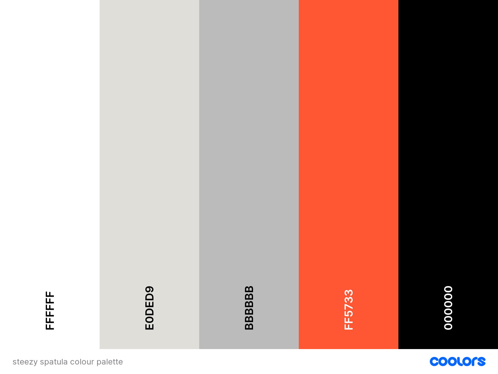
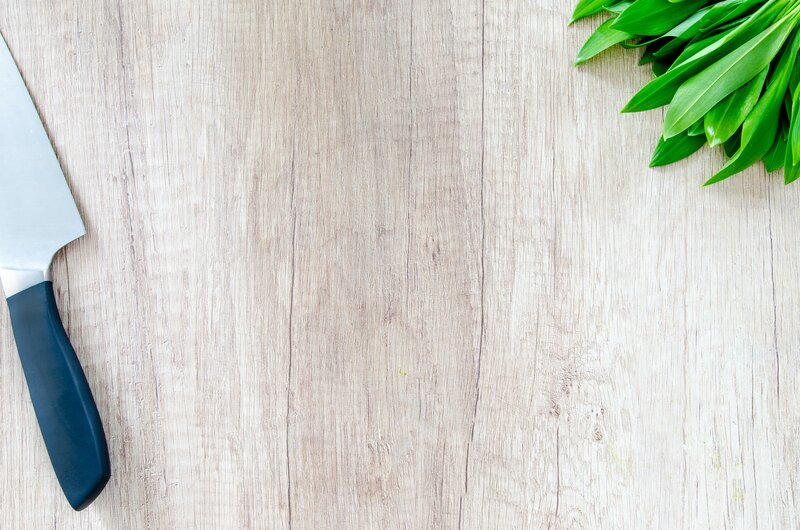

# Steezy Spatula - cooking made less overwhelming

Steezy Spatula is a responsive web application aiming to help people who are struggling with the idea of cooking in general, by providing recipes that are easy to follow and without any unnecessary or additional information. Agile methodology was used to pland and design throughout development. A data model was implemented to make features like managing, querying and manipulating data possible for the users of this website who are able to access these features through authorisation. Registering to the website will give people permission to handle CRUD functionalities such as, create, read, update and delete. For version control GitHub was used. The repository can be found here: [GitHub repository](https://github.com/GaborFicsor/steezy-spatula)

For the admin panel the default django admin dashboard was used, where the admin is able to perform CRUD functionalities related to every model and object.

The live website can be viewed here: [Steezy Spatula - cooking made less overwhelming](https://steezy-spatula.herokuapp.com/)

---

## CONTENTS

* [User Experience](#user-experience)
  * [Client Goals](#client-goals)
  * [User Stories](#user-stories)

* [Design](#design)
  * [Design Thinking](#design-thinking)
  * [Colour Scheme](#colour-scheme)
  * [Typography](#typography)
  * [Imagery](#imagery)
  * [Wireframes](#wireframes)

* [Features](#features)
  * [General Features on Each Page](#general-features-on-each-page)
  * [Future Implementations](#future-implementations)
  * [Accessibility](#accessibility)

* [Technologies Used](#technologies-used)
  * [Languages Used](#languages-used)
  * [Frameworks, Libraries & Programs Used](#frameworks-libraries--programs-used)

* [Deployment & Local Development](#deployment--local-development)
  * [Deployment](#deployment)
  * [Local Development](#local-development)
    * [How to Fork](#how-to-fork)
    * [How to Clone](#how-to-clone)

* [Testing](#testing)

* [Credits](#credits)
  * [Code Used](#code-used)
  * [Content](#content)
  * [Media](#media)
  * [Acknowledgments](#acknowledgments)

## User Experience

The main goal of this website is to give its users the ability to gain more confidence in the kitchen by providing simple recipes. The whole project aims to make the experience the least overwhelming possible. People should not be discouraged by excess information and should only be told the most important things to get started.

People can register on the website which gives them access to features like adding the recipes that they feel are worth sharing in the sense that it would be beneficial to their peers. Registered users can edit or delte their own uploaded recipes to the site. If people don't have any idea to share yet, they are welcome to browse the existing list of recipes that can be found in the recipes section from which they can save recipes to their list that can be viewed anytime under the "My Stuff" tab. Furthermore, users of the site can comment under any recipe and share their thoughts and be a part of a conversation. Comments can also be deleted or updated by the users.

### Client Goals

* To have an immediate understanding of what the website's purpose is.
* To be able to view the site on a range of device sizes, without any distortions that would lower the quality or usability of the website.
* To be able to navigate through the website effortlessly and gain feedback on the actions undertaken to avoid confusion.
* To give users the ability to create, read, edit and delete their recipes and comments.

### User Stories

As a site User

* I want to be able to register on the website to gain access to the full experience provided by the application.
* I want to be able to create and share my recipe.
* I want to have the ability to edit the recipes I have created if needed.
* I want to have the ability to delete the recipes I have created if needed.
* I want to have the ability to view other users' shared recipes.
* I want to have the ability to save and 'unsave' the recipes I like, to access them faster and easier anytime.
* I want to have the ability to engage in conversations regarding a recipe.
* I want to be able to view my recipes in one place to manage them faster and easier.
* I want to be reinforced by the actions I undertake during my time on the website.
* I want to search and filter recipes to cater for my own needs.

## Design

### Design thinking

I was excited to come up with this idea for my project because it is definitely something I could see myself using. I have a bad relationship with cooking so it was easy to have a viewpoint of an end-user of the website. I think the most important thing about the design was to make the whole webpage have the least clutter possible. 

Whenever I look for recipes online there are several websites out there on the web, but I have not found any that is truly focusing on people with depression and anxiety, at least not in regard to cooking. Even if I find an easy recipe on one of these websites I have to scroll down a lot to get to the actual details and information which just further discourages me to look for recipes like this. It is tedious and for people who really need guidance -like me-, it is not a solution. My website however cuts straight to the point with recipes. No description, and no scrolling down, only the relevant and most important information is presented.

One of my proudest accomplishments in designing this website was the idea I had to make the progress bars differently coloured based on a recipe's difficulty, so people can easily judge if they have the mental capacity to follow through, or give it a try another day. There are 4 levels of difficulties, which are easy, moderate, intermediate, and challenging. I had further ideas to make this even better. One of them was to not use discouraging colours like red on the challenging difficulty for example because it might give people the impression that the recipe can be a bit too difficult to handle. The other one was, to not fill the bar all the way up even for the hardest difficulty because that can also be discouraging to people, which I don't want. I would like to further improve this website, maybe research what features the potential users would truly find useful. I think this is a good project idea and I did spend my time polishing the design.

### Colour Scheme 

For the main colour of the design I picked tomato red which goes well with black and white colours, while also making the overall look of the website engaging and visually pleasing. I aimed to make the visitors have a good experience, so they would consider coming back more often.

  
Colour Palette

### Typography

For the font styles I used the default Arial font provided and for some parts I picked [Paytone One](https://fonts.google.com/specimen/Paytone+One?query=Paytone)

  
Paytone One font from Google Fonts

### Imagery 

For the images on the website I used stock images from [pexels](https://www.pexels.com/)

  
background image

  
placeholder image for the recipe card

### Wireframes

During the early stages of development, I tried using [figma](https://www.figma.com/), where I came up with the idea for the landing page, but due to my neurodivergent brain I found it hard and overwhelming to even come up with a rough mock-up for a complete design, however, this is clearly something that I am getting the hang of and I can see myself progressing with.

  
image of the landing page

### Database

For creating a relational database diagram, I used [figma](https://www.figma.com/). For this project I created 2 models, one for the recipes and one for the comments. There is also a model for the users which was generated by django-allauth.

  
image of the relational database

## Features

The main pages of the website are a landing page, a recipes page and a profile page. Further pages for features include: creating and editing forms, authorization pages provided by django-allauth, custom error pages for 400, 403, 404 and 500 errors, and a confirmation page with the purpose of defensive design.

All pages on the website are responsive, have a favicon and a unique title displaying in the browser tab. Every page shares a common navbar and a footer section.
### Landing Page

The landing page is what users see the first time they visit my website, so I wanted to make it eye-catching by having a site logo with a slogan on display, and a short explanation as to who this site is dedicated to. The landing page also features a call to action button -only present when the user is not logged in- which takes the visitor to the registration form. Further down a short description can be found about me, where I explain the purpose and the targeted audience.

  
image of the landing page

### Recipes Page

  
image of the recipes page

  
image of the recipe filter

The recipes page give the users a well structured and designed view of the uploaded recipes. A filter form placed at the top give people the ability to search and filter for recipes by narrowing down their needs. Users can filter by looking up words, select a  difficulty, type or strictly vegan recipes, It is also possible to combine these filters to get the best result possible.

  
image of 'add your own' link

Below the filter form a short text saying 'add your own' serves as a hyperlink that takes the user to the recipe creation form.

  
image of a recipe card

For the most part, the page can hold 9 entries at once, any more results will create a pagination, where people can browse by looking at different pages. Recipes shown are ordered by their date of creation, with the most recent showing up first. The recipes are presented in a form of a card where -to my judgement- the utmost important details are presented, which are an image, a title, the cooking time and a progress bar which gives a visual representation of how difficult the task could be. All of this combined can give people the ability to judge if they can tackle it, or decide that they look further. There is also a small indicator at the top left corner of a recipe if it's vegan-friendly, so people who only eat vegan food can find these recipes more easily.

  
image of pagination

Mentioned above, at the bottom of the recipes page a pagination can be found to help navigating if there are more results than 9 at once. 

### My Stuff

When the user clicks on the 'My Stuff' tab in the navigation bar, they are directed to their profile page that displays their username and the date they registered on the website. In addition, the page includes two tables that allow the user to view their shared and saved recipes, providing a convenient and accessible way to keep track of their recipes.

My recipes table holds entries of the recipes that the current user has ever uploaded to the website. Over the table next to the title 'my recipes' a plus sign serves as a link to the recipe creation form. In the table are 3 columns present. The first one is the recipe's name which also serves as a hyperlink to the corresponding recipe's detailed page. A pencil icon represents the ability to edit the corresponding recipe. Clicking this icon will take the user to the recipe's editing form. Lastly, a trash-can icon is used to indicate the ability to delete the corresponding recipe. Clicking this icon will take the user to a confirmation page, where they need to affirm their intentions.

  
image of 'My Stuff'

On the 'My Stuff' page, there is a table dedicated to displaying all the recipes they have uploaded to the website, titled "My Recipes." At the top of the table, there is a plus sign that serves as a link to the recipe creation form. The table consists of three columns. The first column displays the name of each recipe and serves as a hyperlink to the detailed page for that recipe. The second column features a pencil icon, which allows the user to edit the corresponding recipe. Clicking the pencil icon takes the user to the recipe's editing form. Finally, the third column contains a trash-can icon, which provides the user with the option to delete the corresponding recipe. Upon clicking the icon, the user is redirected to a confirmation page, where they can confirm their intention to delete the recipe.

  
image of my recipes

If the user has not created any recipes yet, instead of a table a text is shown saying, 'Looks like you haven't added anything just yet! Share your recipes with us here', the word 'here' at the end serves as a hyperlink to the recipe creation page.

  
image of my saved recipes

The second table holds entries that have been saved by the user. Three table columns hold information about the recipe's name, which is also a hyperlink to the corresponding recipe's detailed page, the recipe's author, and a button to 'unsave' or 'delete' recipes from this list. Any recipe on the website can be saved, and it only takes one click to add them to this list. If, however, the user has not saved any recipes yet, instead of a table a text is present, saying 'Any recipe you fancy will be saved here for You', the word 'recipe' serves as a hyperlink to the recipes page.

  
image of logo

At the bottom of the 'My Stuff' page, the site logo is shown only for visual purposes. I'm particularly proud of coming up with this logo, and I deliberately used it over all the pages where I could include it. The error pages follow the logo's structure which will later be talked about.

### Recipe detail page

  
image of recipe detail page

At this point, the users have more ways to access a detailed page of a recipe, but the most straightforward way is to access them via the recipes page. Clicking on a recipe card will take the user to the detailed page of the recipe, where they can see the title, the author, and the date of creation of the recipe they clicked on. There is also a button that shows up for registered users which is the 'save' button. Clicking this button will 'save' this recipe to the user's 'my saved recipes' table mentioned earlier. If a recipe is not 'saved' an empty flag icon is present. After clicking this button the icon changes to a solid flag and an alert message pops up saying that the current recipe the user is viewing has been successfully saved to their list. Clicking again this button replaces the icon to its original form and an alert message pops up saying that the current recipe the user is viewing has been removed from their saved recipes list. This process can also be done on the 'My Stuff' page.

  
image of buttons

If the user is viewing the detailed page of a recipe that they created, there are also two icons present next to the 'save' button. Which are the pencil icon for editing and trash can icon for deleting.

  
image of page details section

The first row of the detail section shows an image of the recipe, which is either a placeholder image or an image of the actual recipe if it was provided by the author. Next to the image, A short details section gives information about the recipe's type, preparation and cooking time, the calories and serving size, difficulty, and finally, if it contains Nuts, Dairy or both at the same time it is also shown.

  
image of ingredients and method section

The next section is the ingredients and method sections which hold information regarding the ingredients and the steps to follow.

  
image of comment

At the bottom of the recipe detail page, a comment section can be found which is only available to the registered users of the website. If there are no comments yet under a recipe, a text is shown saying 'Be the first to comment!' with the comment form next to it. The comment form is a text area where people can write and submit a comment with the button below. Doing so will display the newly submitted comment and make an alert pop-up that the comment has been added. The current username is also reflected on the form. If there are comments under a recipe, they are listed below each other with the most recent comment at the top. Each comment has information about the author and the date of creation. If the current user is the author of a comment, a pencil icon for editing and a trash can icon for deleting the comment is shown. The pencil icon takes the user to the comment editing form where they can update and resubmit their comment. Doing so will make an alert pop-up saying that the comment has been updated successfully. Clicking on the trash-can icon will take the user to a confirmation page, where they need to affirm their intentions.

Authorization pages

  
image of register page

If a user decides to register to the website, they can do so by clicking either on the 'Register' button in the navbar or by clicking the call to action button on the landing page. Both actions will take the user to the sign-up form, where they need to choose a unique username and password. The E-mail address is set to optional. If the user has already registered to the website, there is a link at the top that will take them to the login form if clicked.

  
image of login page

If a user wants to log in after returning to the website they can do so, by clicking on the login button in the navbar. Here they need to type in their username and password and they can make the website remember them, so they don't have to log in every time they visit the website. If the user is not registered yet and therefore can not use the login form to enter the website, a link is present at the top that will take them to the signup form. If the user filled out the login form and pressed the sign in button they are then taken back to the landing page with an alert message saying that they have successfully logged in.

  
image of logout page

If a user wants to sign out, they can do so by clicking on the Logout link on the navigation bar. This action will take the user to the Sign Out page where they can choose to click on 'Sign Out' or 'Cancel'. Clicking on 'Sign Out' will take the user back to the landing page with a message saying they have successfully signed out.

  
image of delete form

Before a delete request can be processed, the user needs to confirm this with a form. Confirming the deletion will take the user back to the recipes page and an alert will pop up saying that the deleting was successful.

  
image of creation form

Navigating to the creating form of a recipe can be done more than one way at this point. The form has a Recipe name field, a type field, checkboxes for being vegan or containing dairy or nuts, an ingredients and method field, preparation time and cooking time, serving size, calories and difficulty. Lastly, the user can provide an image for the recipe but it's not mandatory. If the user doesn't provide an image, a placeholder image will be shown instead on the recipe card and the recipe's detailed page as well. Submitting the form will take the user back to the recipes page and an alert message pops up saying the recipe has been added successfully.

  
image of editing form

Reaching the editing page of a recipe can be done more than one way at this point. This form is very similar to the creating form except all the fields are pre-populated with the existing data, and the user is able to manipulate every field and submit their updated version. The form also tells the user when the recipe was added, and when was it last updated. If the user submits the updated recipe an alert message will pop up saying that the update was successful.

  
image of comment edidting form

The comment editing form can only be accessed through the recipe detail page where the comment the user wants to edit is present. There he can click on the pencil icon mentioned earlier which takes them to the comment editing form page where they can edit and resubmit their comment. Doing so will take them back to the recipes page and an alert message will pop up saying the comment was updated successfully.

  
image of error 404 page

  

Deleting either a recipe or a comment can be done by finding a trash-can icon of the recipe or the comment the user wants to delete. Clicking the trash-can icon will take them to a page where they need to confirm their action. Deleting an item will take them back to the recipes page with an alert saying the request for deletion was successful, and the item no longer exists.

As mentioned earlier, there are four custom error pages provided to the website. The most common is the 404 which is shown to the user if they navigate to a page that does not exist, for example a recipe that has been deleted.

## Future Implementations

### Ideas for later

 * A complete profile page with a profile picture that shows up on the user's profile, by their added recipes, and by their comments
 * The ability to like a recipe
 * The ability to rate a recipe by the users, get general feedback and emphasize the best recipes
 * Give users the ability to send private messages to other members
 * Give users the ability to view other member's profile pages where their added recipes are listed
 * A blog page where I can suggest recipe books to the users and give them advice regarding handy devices and tools for cooking

### Things did not get implemented at this stage

 * Design a visually more pleasing recipe detail page.
 * Make the Django Summernote text field strip the styling of the text if a user is trying to paste it from an external source.
 * Make the page layout better by considering all screen sizes.
 * Prevent the page from reloading when the save/unsave button is pressed.
 * Improve the redirect urls after a successful form is submitted

### Accessibility

* With keeping accessibility in mind, I provided aria-label texts to hyperlinks as well as to buttons. Also, a description of the images can be found throughout the website.

* I tried using colours that are visually appealing while also maintaining a good contrast so that every text is easily readable.

## Technologies Used

### Languages Used

* HTML
* CSS
* JavaScript
* Python

### Frameworks, libraries and other external tools

* [Cloudinary](https://cloudinary.com) - for storing images
* [Django Framework](https://www.djangoproject.com/) - for rapid development and maintaining the database of the website
* [Django-Crispy-Forms](https://django-crispy-forms.readthedocs.io/) - for rendering forms
* [Django-Allauth](https://django-allauth.readthedocs.io) - for authorization
* [Django-Filter](https://django-filter.readthedocs.io/) - for creating a filter for my Recipe model
* [Django-Summernote](https://summernote.org/) - for rendering textfields in the forms
* [Gunicorn](https://gunicorn.org/) - for HTTP requests and to run a Python web application.
* [Psycopg2](https://pypi.org/project/psycopg2/) - for PostgreSQL engine
* [ElephantSQL](https://www.elephantsql.com/) - for storing database 
* [Bootstrap 5.3.0](https://getbootstrap.com/) - for accelerated styling and responsiveness of the website
* [One Page Wonder](https://startbootstrap.com/theme/one-page-wonder) - for navbar, header footer and a circle image styling
* [jQuery](https://jquery.com/) - for hiding alert messages automatically and set the progress bar's colors based on the difficulty
* [Git](https://git-scm.com/) - for version control
* [GitHub](https://github.com/) - for storing the project repository
* [Gitpod](https://gitpod.io/) - as an IDE for creating the code
* [Heroku](https://dashboard.heroku.com/) - for deploying the application
* [Figma](https://www.figma.com/) - for creating a mock-up landing page
* [Coolors](https://coolors.co/) - for visual representation of the colours used on the page
* [Favicon](https://favicon.io/) - for creating the favicon
* [Cssgradient](https://cssgradient.io/) - for adding an overlay to the background image
* [Picresize](https://picresize.com/) - for resizing images
* [Google Fonts](https://fonts.google.com/) - Catamaran and Seaweed fonts
* [Font Awesome](https://fontawesome.com/) - for using icons
* [Pexels](https://pexels.com/) - for the background image

### Validators

* [W3C Markup Validation](https://validator.w3.org/)
* [W3C Jigsaw](https://jigsaw.w3.org/css-validator/)
* [JSHint](https://jshint.com/)
* [CI Python Linter](https://pep8ci.herokuapp.com/)

### Deployment

 1. Create Repository using Code Insitute's Full Template
 2. Open repository in gitpod IDE
 3. Install Django and supporting libraries
 4. Update requirements.txt
 5. Create Django project
 6. Create recipes app
 7. Add recipes to INSTALLED_APPS in settings.py
 8. Migrate changes to the database
 9. Create a procfile for deployment to Heroku
 10. Create new app on Heroku and connect to GitHub repository
 11. Create ElephantSQL database for the project
 13. Create env.py
 14. Create Recipe and Comment models in models.py
 15. Create migration file and migrate changes to database
 16. Push changes to github
 17. Add config vars to Heroku
 18. Deploy Branch from main - create app from the last commit pushed to github
 19. Set DEBUG to false before final deployment

### Forking

1. Open Gitpod and log in to your account.
2. Open the GitHub repository that you want to clone.
3. Navigate to the top right corner of the sceen, and click on 'Fork'
4. Select create new fork
5. Once the process is complete, you will be redirected to the newly forked repository

### Cloning

1. Go to the repository you want to clone on GitHub.
2. Click on the green "Code".
3. Click on the clipboard icon to copy to clipboard.
4. In gitpod, open a new workspace.
5. Navigate to the directory where you want to clone the repository.
6. Type the command "git clone" followed by the copy on your clipboard.
7. Press Enter to generate local clone.

## Testing

## Bugs

### Solved

* Model relation During early development, I had issues with my models, when I was trying to connect my Recipe model with a many-to-many relationship to a model called Allergens. My lack of understanding of how a many-to-many relationship should work ended me up breaking my models beyond repair. Not even deleting the model from the models.py helped. I had to contact Code Institute Tutor Support where Jason helped me out a lot by giving instructions on how to reset my database.

* Rendering form field in template:
At a later stage in development, I was trying to render the filter form in my recipe template. At this stage, it had 3 fields to filter by, of which one was a TextInput field to look up recipes. I wanted to render every field individually to be able to style them easier, rather than using crispy forms, but my text field would not want to render. When I tried to render {{ form.recipe_name|as_crispy_field }} I got an error stating that the field that I am trying to pass is either non-existent or invalid. I had to contact Code Institute Tutor Support where Joshua pointed out that I am using the icontains lookup type the wrong way. Adding lookup_expr='icontains' to the variable inside the RecipeFilter Class solved this problem and the field was rendering as expected. 

* Pagination bug, during manual testing I found that after filtering the recipe list I was able to look through the paginated views in my recipes template, by viewing the next pages, however, when I tried to click on the previous page the filtered list was not working properly and every recipe got listed again without filtering. Replacing the correct url inside the first and previous page-links solved this problem

## Credits

* [Django Class Based views filtering](https://gist.github.com/MikaelSantilio/3e761b325c7fd7588207cec06fdcbefb)
* [Special Hack To Style Pagination With Bootstrap](https://www.youtube.com/watch?v=wY_BNsxCEi4)
* [Display Multiple Queryset in List View](https://stackoverflow.com/questions/48872380/display-multiple-queryset-in-list-view)
* [Pagination using ListView and dynamic/filtered queryset](https://stackoverflow.com/questions/52007038/pagination-using-listview-and-a-dynamic-filtered-queryset)
* Comment model - Code Institute's I think therefore I blog walkthrough project
* Alert timeout - Code Institute's I think therefore I blog walkthrough project

### Media

* [Background image - from pexels](https://www.pexels.com/hu-hu/foto/kenyer-elelmiszer-szendvics-egeszseges-1565982/)
* [Placeholder recipe image - from pexels](https://www.pexels.com/hu-hu/foto/egeszseges-fa-textura-asztal-349609/)
* A picture of me - represented by my favourite Teddy Bear
* [Favicon](https://favicon.io/)

  
###  Acknowledgments

I would like to thank
 * my girlfriend, for testing the usability and user experience of the website, as well as creating a profile and uploading recipes.
 * my Mentor [Jubril Akolade](https://github.com/Jubrillionaire) for taking the time to review my project and answering my questions.
 * Code Institute Tutor staff: Joshua, Ed, and Jason for helping me out with problems I would have not be able to solve on my own.
