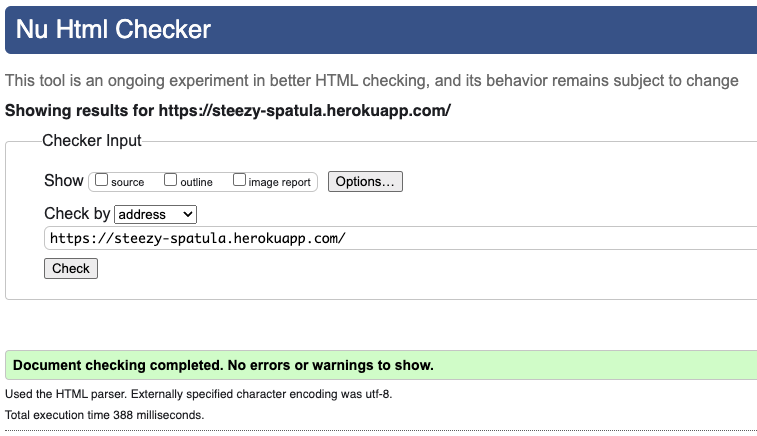
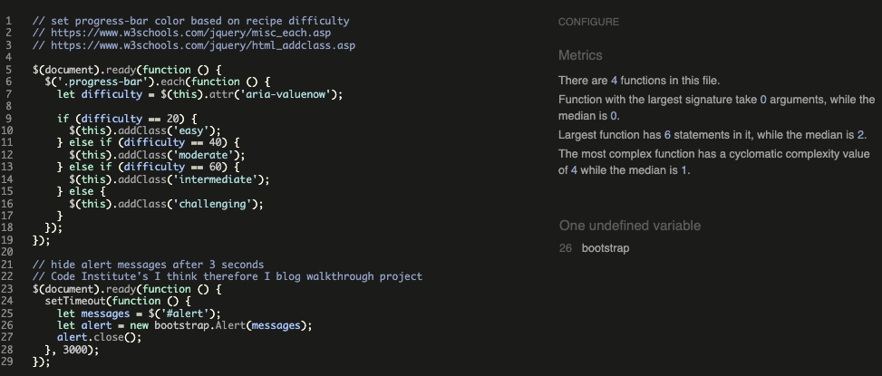
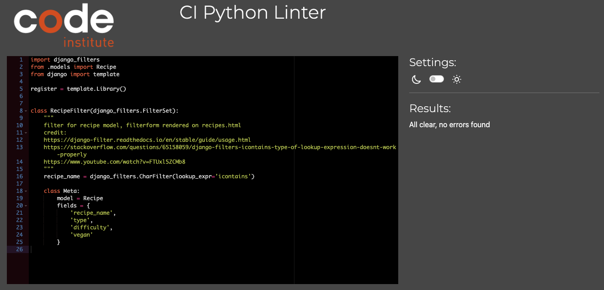
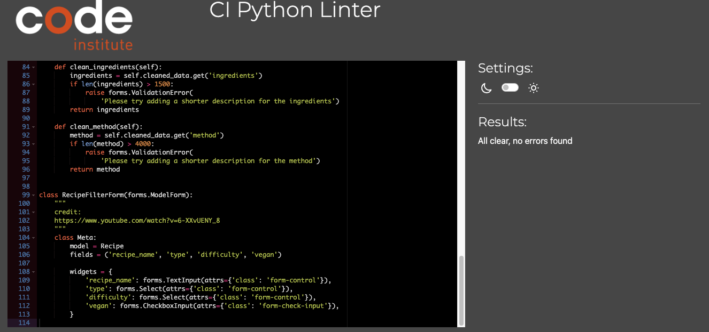
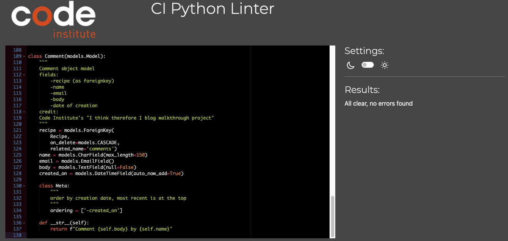
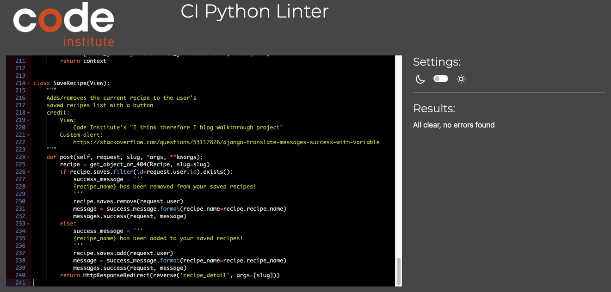
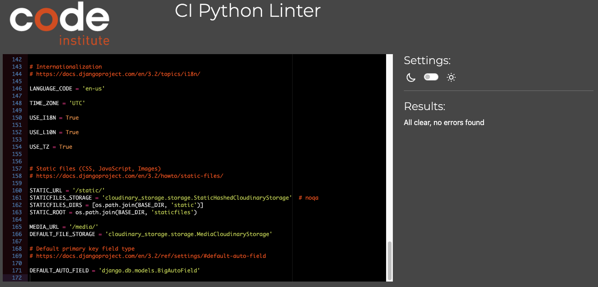
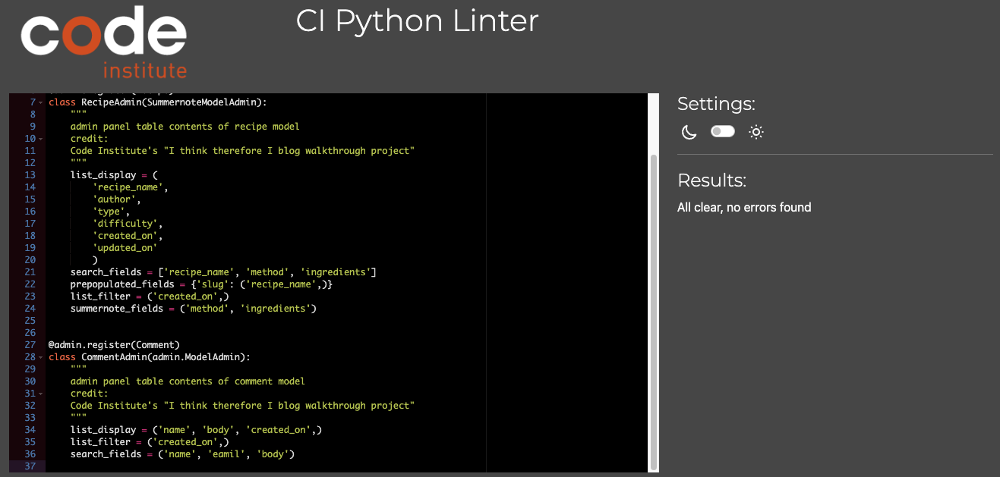

# Steezy Spatula - cooking made less overwhelming - Testing

[Back to README.md](https://github.com/GaborFicsor/steezy-spatula/blob/main/README.md)

[GitHub repository of this project](https://github.com/GaborFicsor/steezy-spatula)

[Deployed website on Heroku](https://steezy-spatula.herokuapp.com/)

## CONTENTS

* [AUTOMATED TESTING](#automated-testing)
  * [W3C Validator](#w3c-validator)
  * [Lighthouse](#lighthouse)
  * [WAVE](#wave)

* [MANUAL TESTING](#manual-testing)
  * [Testing User Stories](#testing-user-stories)
  * [Full Testing](#full-testing)

* [BUGS](#bugs)
  * [Known Bugs](#known-bugs)
  * [Solved Bugs](#solved-bugs)

---

## AUTOMATED TESTING

For automated testing the following external validators were used:
* [W3C Markup Validation](https://validator.w3.org/)
* [W3C Jigsaw](https://jigsaw.w3.org/css-validator/)
* [JSHint](https://jshint.com/)
* [CI Python Linter](https://pep8ci.herokuapp.com/)

###  W3C Markup Validator

The deployed project's address was passed for checking and the result returned with no errors or warnings

### W3C CSS Validator

CSS validation was done by direct input and the result returned with no errors or warnings

### JSHint Validator

JSHint Validator was used to validate JavaScript code written in jQuery framework

### Code Institute's Python Linter

* Validating python code was carried out by manually pasting the code from each python files manually written for this project
* No errors were returned 

  
filters.py linter result

  
forms.py linter result

  
urls.py linter result

  
models.py linter result

  
views.py linter result

  
settings.py linter result

  
app.py linter result

  
admin.py linter result

## Accessibility

* With keeping accessibility in mind, I provided aria-label texts to hyperlinks as well as to buttons. Also, descriptions of the images can be found throughout the website.

* I tried using colours that are visually appealing while also maintaining a good contrast so that every text is easily readable

* The current page the user is viewing is reflected in the navigation bar by highligting

## MANUAL TESTING

### Testing User Stories

### Full Testing

## Bugs

### Solved

* Model relation During early development, I had issues with my models, when I was trying to connect my Recipe model with a many-to-many relationship to a model called Allergens. My lack of understanding of how a many-to-many relationship should work ended me up breaking my models beyond repair. Not even deleting the model from the models.py helped. I had to contact Code Institute Tutor Support where Jason helped me out a lot by giving instructions on how to reset my database.

* Rendering form field in template:
At a later stage in development, I was trying to render the filter form in my recipe template. At this stage, it had 3 fields to filter by, of which one was a TextInput field to look up recipes. I wanted to render every field individually to be able to style them easier, rather than using crispy forms, but my text field would not want to render. When I tried to render {{ form.recipe_name|as_crispy_field }} I got an error stating that the field that I am trying to pass is either non-existent or invalid. I had to contact Code Institute Tutor Support where Joshua pointed out that I am using the icontains lookup type the wrong way. Adding lookup_expr='icontains' to the variable inside the RecipeFilter Class solved this problem and the field was rendering as expected. 

* Pagination bug, during manual testing I found that after filtering the recipe list I was able to look through the paginated views in my recipes template, by viewing the next pages, however, when I tried to click on the previous page the filtered list was not working properly and every recipe got listed again without filtering. Replacing the correct url inside the first and previous page-links solved this problem
